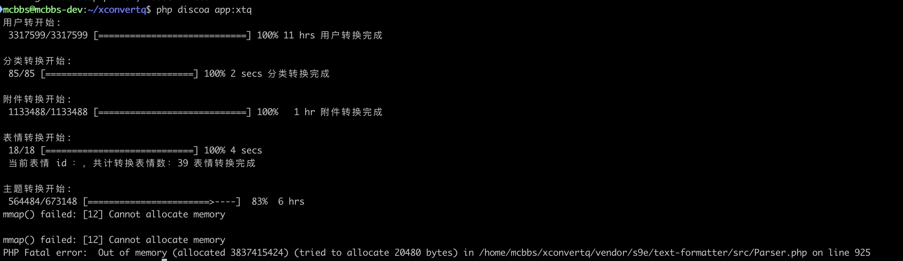

# XconvertQ.js

XconvertQ是使用nodejs重写的改进 [官方转换工具](https://discuz.com/docs/Discuzto.html) 效率的转换工具 

# Why

官方转换工具基本不具备转换中大型站点的能力


 - 三百万用户转换耗时11小时
 - 67万主题，转换至6小时，进度83%时，耗尽测试环境主机内存(4GB)，PHP进程OOM崩溃

本工具转换速度是官方的十倍


 - 三百万用户转换大约只需要一小时多


 - 主题只需要不到半小时

# 使用
```sql 
set global max_allowed_packet = 1073741824;
```

 TBD
